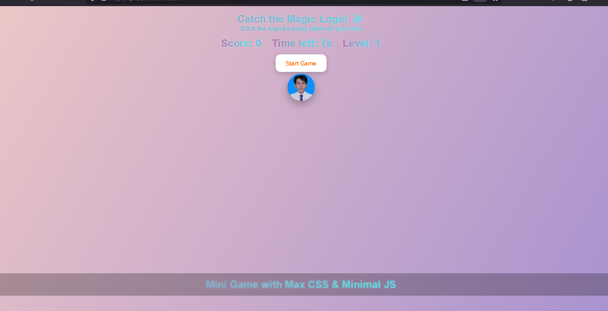

# Magic Click Game

A web-based mini clicker game where players try to click a moving magic button as many times as possible, with score, levels, and particle effects. Built with CSS-heavy animations and minimal JavaScript.

## Features
-Click a moving button to earn points
-Level up every 5 points with visual effects
-Countdown timer with flashing effect
-Particle burst animation on each click
-Responsive design for mobile and desktop
-Fun CSS gradient animations and effects

## Technologies
-HTML
-CSS (animations, gradients, effects)
-JavaScript (Vanilla JS)
-Audio effects (click, level up, game over)

## How to Run
1. Clone or download this repository
2. Open index.html in your browser
3. Make sure the img/ and sounds/ folders are in the project
4. Click Start Game and enjoy!

## Screenshots

## Author
- Name: [sundusit pumpeda]
- GitHub: [https://github.com/sundusitp](https://github.com/sundusitp)
